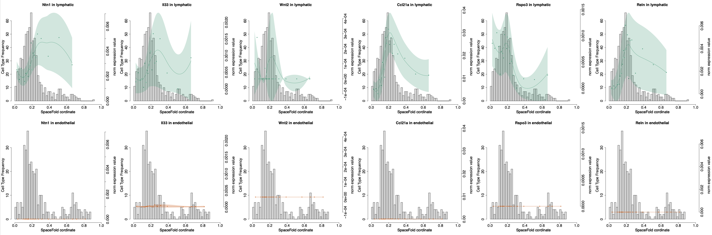

SpaceFold 2.0
========

Mapping gene expression cartography from spatial transcriptomics for tissues with stereotypical structures.


What's new?

We developed a new doising method using data diffusion over the imputed SpaceFold axis to oversome sparsity of Visium data and further improve the resolution of cartography over the sliding window mean used by the v1.0 (the SpaceFold paper).   

The new version v2.0 is compatible with the new BayesPrism package (https://github.com/Danko-Lab/BayesPrism).


A comparison between v1.0 and v2.0:

v1.0:


v2.0:


1 Cloud Computing Service:
---------------

We provide a computational gateway to run BayesPrism on a HPC server, and visualize SpaceFold cartography for mouse small and large intestine tissues. (Available in early July)


2 Cite SpaceFold:
-----------

Cell type and gene expression deconvolution with BayesPrism enables Bayesian integrative analysis across bulk and single-cell RNA sequencing in oncology

A lymphatic-stem cell interactome regulates intestinal stem cell activity

https://www.biorxiv.org/content/10.1101/2022.01.29.478341v1

3 Workflow of SpaceFold
--------


4 Installation
--------

* R packages:
	
	BayesPrism, expm, msir, mixtools, mclust, phateR, RColorBrewer, beeswarm, dplyr

* If all dependent packages and commands have been installed, please use the following codes to install/update the package in R terminal. 

```````
library("devtools");
install_github("dpeerlab/SpaceFold/SpaceFold")
```````


5 Usage
----------
library(SpaceFold)

See the vignette.R for details.

	
6 FAQ 
----------------------------------------------------------------------
1) What if the assumption made by SpaceFold?

SpaceFold assumes that 1) the tissue has an underlying 1D structure; 2) it is a  stereotypical structure that is repeatedly sampled by ST; 3) the cell type fraction of a spatial spot is sufficient in inferring its physical cordinate along the 1D axis.


8 Documents
----------

* R vignette:
vignette.R


* R manual:
 (Coming soon)
